# py-image-to-threshold-map
Converts input bitmaps to ordered threshold maps for dithering.

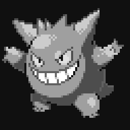 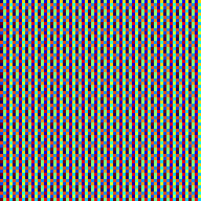 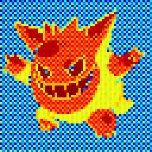
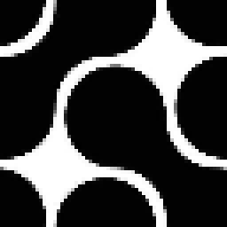 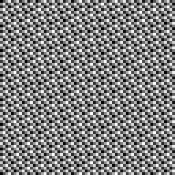 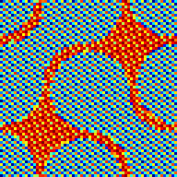
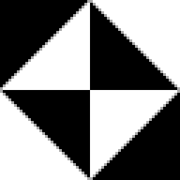 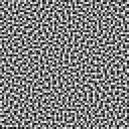 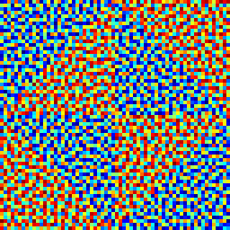

 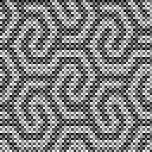

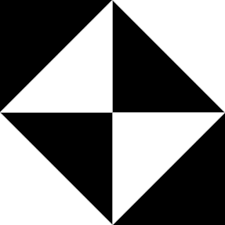 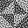

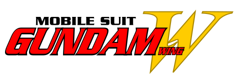 

Example of the threshold maps being applied in a [Unity post process shader](https://www.artstation.com/artwork/dyA5g3)
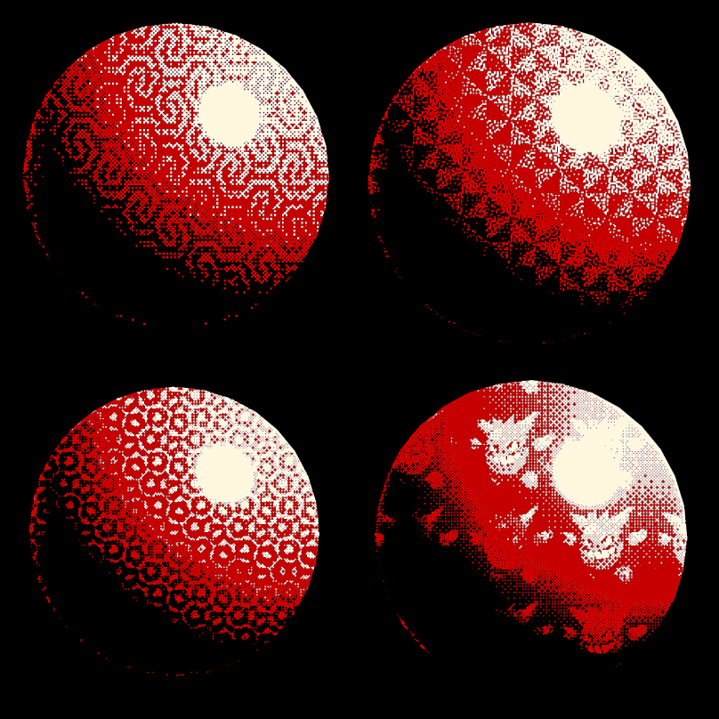

Blue Noise function from Bart Wronski:
https://bartwronski.com/2022/08/31/progressive-image-stippling-and-greedy-blue-noise-importance-sampling/
