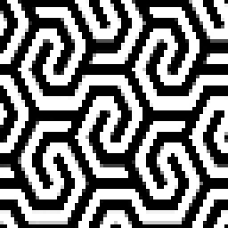
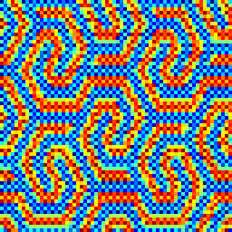
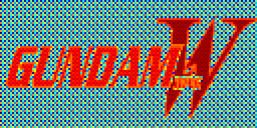

# py-image-to-threshold-map
A small python module to convert input bitmaps to ordered threshold maps for dithering.
The maps are created by sorting every pixel by luminance and then normalizing the result. The final threshold map has a perfectly flat histogram.

Example of the threshold maps being applied in a [Unity post process shader](https://www.artstation.com/artwork/dyA5g3)

To get an even spread the luminance should be mixed with existing dither pattern since images with big uniform areas result in clustering.
The availabe patterns are Bayer Matrix 2x2 - 8x8, Interleaved Gradient Noise and Blue Noise. 
Final threshold maps here in false color demonstration.

  
  
  
  

Images need to be rounded to power-of-two. Supports non-square images.

Blue Noise function from Bart Wronski:
https://bartwronski.com/2022/08/31/progressive-image-stippling-and-greedy-blue-noise-importance-sampling/
